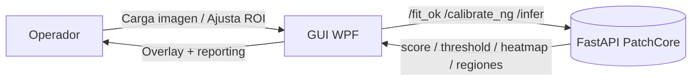
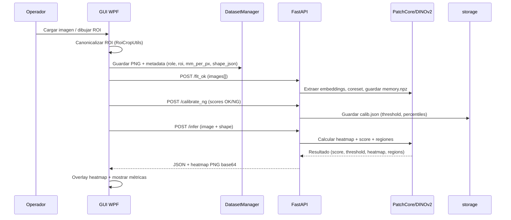

# 📌 Actualización — 2025-10-07

**Cambios clave documentados en esta versión:**
- Se actualizan los componentes GUI/Backend para reflejar las clases activas (`BackendClient`, `DatasetManager`, `InferenceEngine`).
- Diagramas y flujo end-to-end alineados con los endpoints estables (`/fit_ok`, `/calibrate_ng`, `/infer`).
- Se documenta la sincronización ROI ↔ heatmap y la persistencia `backend/models/<role>/<roi>/` según `ModelStore`.

# ARCHITECTURE — BrakeDiscInspector

Visión global del sistema BrakeDiscInspector, compuesto por una GUI WPF para gestionar ROIs y un backend FastAPI que ejecuta PatchCore + DINOv2. Incluye componentes, flujo de datos y pautas de extensibilidad.

---

## Índice rápido

- [Visión general](#1-visión-general)
- [Componentes](#2-componentes)
- [Flujo de datos end-to-end](#3-flujo-de-datos-end-to-end)
- [Sincronización de coordenadas](#4-sincronización-de-coordenadas)
- [Backend — inferencia y persistencia](#5-backend--inferencia-y-persistencia)
- [Extensibilidad segura](#6-extensibilidad-segura)
- [Recursos cruzados](#7-recursos-cruzados)
- [Glosario rápido](#glosario-rápido)

---

## 1) Visión general

El sistema se divide en dos procesos que colaboran en tiempo real:

- **GUI (WPF / .NET 8)**: captura imágenes, permite dibujar/rotar ROIs, gestiona datasets (`datasets/<role>/<roi>/<ok|ng>/`), llama al backend para entrenar/calibrar/inferir y superpone heatmaps.
- **Backend (FastAPI / Python 3.10+)**: recibe ROIs ya canónicos, extrae embeddings con DINOv2 ViT-S/14, ejecuta PatchCore y devuelve score + heatmap + regiones filtradas.

---

## 2) Componentes

### 2.1 GUI (WPF)

- **MainWindow.xaml/.cs** — Orquesta pestañas Dataset/Train/Infer y binding con `WorkflowViewModel`.
- **Workflow/BackendClient.cs** — Cliente HTTP asíncrono para `/health`, `/fit_ok`, `/calibrate_ng`, `/infer` (gestiona `HttpClient`, JSON y errores).【F:gui/BrakeDiscInspector_GUI_ROI/Workflow/BackendClient.cs†L20-L218】
- **Workflow/DatasetManager.cs** — Exporta ROIs canónicos (PNG) y metadatos (`shape_json`, `mm_per_px`, `angle`, `timestamp`).【F:gui/BrakeDiscInspector_GUI_ROI/Workflow/DatasetManager.cs†L18-L80】
- **Workflow/DatasetSample.cs** — Lee metadatos y genera thumbnails para la UI.【F:gui/BrakeDiscInspector_GUI_ROI/Workflow/DatasetSample.cs†L1-L120】
- **ROI/*.cs & RoiAdorner.cs** — Adorners y modelo ROI; NO modificar geometría ni transformaciones.【F:gui/BrakeDiscInspector_GUI_ROI/RoiAdorner.cs†L1-L200】
- **RoiCropUtils.cs** — Pipeline de canonicalización (rotación + recorte) y máscara ROI.【F:gui/BrakeDiscInspector_GUI_ROI/RoiCropUtils.cs†L62-L200】

### 2.2 Backend (FastAPI)

- **app.py** — Endpoints `/health`, `/fit_ok`, `/calibrate_ng`, `/infer`, manejo de errores y conversión heatmap→PNG.【F:backend/app.py†L1-L214】
- **features.py** — `DinoV2Features` (modelo `vit_small_patch14_dinov2.lvd142m`) con resize y normalización automática.【F:backend/features.py†L1-L200】
- **patchcore.py** — Construcción de memoria (coreset k-center greedy) y kNN (FAISS opcional).【F:backend/patchcore.py†L1-L200】
- **infer.py** — `InferenceEngine.run` genera heatmap, percentiles, máscaras y regiones con áreas px/mm².【F:backend/infer.py†L17-L181】
- **calib.py** — Selección de threshold a partir de percentiles OK/NG (`choose_threshold`).【F:backend/calib.py†L1-L120】
- **storage.py** — Persistencia en `models/<role>/<roi>/` (`memory.npz`, `index.faiss`, `calib.json`).【F:backend/storage.py†L12-L79】
- **roi_mask.py** — Reconstrucción de máscaras (`rect`, `circle`, `annulus`) para enmascarar heatmaps.【F:backend/roi_mask.py†L1-L160】

---

## 3) Flujo de datos end-to-end

Notas clave:
- El backend nunca rota ni recorta imágenes; depende del ROI canónico exportado por la GUI.
- El `shape` opcional limita la zona evaluada dentro del ROI.

---

## 4) Sincronización de coordenadas

- La imagen principal se muestra con `Stretch="Uniform"`; `RoiOverlay` calcula escala y offsets para mantener la relación imagen↔canvas.
- Conversión:
  - Imagen → Canvas: `canvas = image * scale + offset`.
  - Canvas → Imagen: `image = (canvas - offset) / scale`.
- El heatmap devuelto (`heatmap_png_base64`) tiene el mismo tamaño que el ROI canónico; se superpone directamente usando `ImageBrush` en la GUI.

---

## 5) Backend — inferencia y persistencia

1. **Carga de imagen**: `app.py` lee el `UploadFile`, lo decodifica con OpenCV y extrae embeddings (`DinoV2Features`).【F:backend/app.py†L46-L92】
2. **Memoria**: `ModelStore.load_memory` reconstruye el coreset y, si existe, el índice FAISS guardado en disco.【F:backend/storage.py†L38-L64】
3. **Inferencia**: `InferenceEngine.run` genera heatmap, aplica máscara (`roi_mask.build_mask`), calcula score (p99) y filtra contornos por `area_mm2_thr`.【F:backend/infer.py†L66-L181】
4. **Respuesta**: `app.py` convierte el heatmap a PNG base64, añade `token_shape`, `regions` y `threshold` (si calibrado).【F:backend/app.py†L168-L214】
5. **Persistencia**: `/fit_ok` sobrescribe `memory.npz`/`index.faiss`; `/calibrate_ng` guarda `calib.json` con percentiles y parámetros.

---

## 6) Extensibilidad segura

- **GUI**: se pueden añadir nuevas vistas o reportes, pero debe reutilizarse `RoiCropUtils` y respetar adorners existentes (no alterar geometría ni transformaciones).
- **Backend**: los endpoints `/health`, `/fit_ok`, `/calibrate_ng`, `/infer` son contratos estables. Añadir rutas nuevas requiere documentarlas en `API_REFERENCE.md`.
- **Persistencia**: cualquier cambio en el formato de `memory.npz`, `index.faiss` o `calib.json` debe versionarse explícitamente y acompañarse de migraciones/documentación.
- **Observabilidad**: seguir [LOGGING.md](LOGGING.md) para mantener correlación GUI↔backend y rotación de logs.

---

## 7) Recursos cruzados

- [README.md](README.md) — Visión general y quick start.
- [DEV_GUIDE.md](DEV_GUIDE.md) — Setup de desarrollo y estándares de código.
- [API_REFERENCE.md](API_REFERENCE.md) — Contratos HTTP y ejemplos `curl`.
- [DATA_FORMATS.md](DATA_FORMATS.md) — Esquemas de requests/responses y artefactos en disco.
- [ROI_AND_MATCHING_SPEC.md](ROI_AND_MATCHING_SPEC.md) — Geometría ROI, canonicalización y máscaras.
- [DEPLOYMENT.md](DEPLOYMENT.md) — Despliegues locales/producción y troubleshooting.
- [LOGGING.md](LOGGING.md) — Política de observabilidad.

---

## Glosario rápido

- **ROI canónica**: recorte alineado (crop + rotación) generado por la GUI; es la entrada directa al backend.
- **PatchCore**: algoritmo que usa un coreset de embeddings OK para realizar kNN y detectar anomalías.
- **Token shape**: dimensiones (`Ht`, `Wt`) del grid DINOv2 previo al reescalado; se mantiene constante entre entrenamiento e inferencia.
- **Shape JSON**: máscara opcional (`rect`, `circle`, `annulus`) expresada en píxeles del ROI canónico; se usa para recortar el heatmap.
- **Threshold**: valor obtenido en `/calibrate_ng` que se aplica para decidir regiones relevantes en `/infer`.
