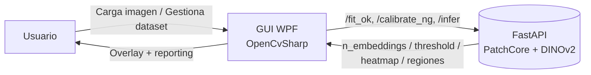
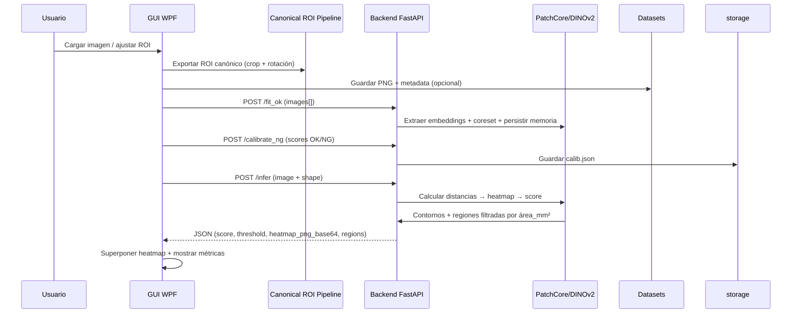

# ARCHITECTURE — BrakeDiscInspector

Este documento describe la arquitectura actual (GUI + backend), el flujo de datos extremo a extremo y las zonas donde se pueden extender las funcionalidades sin romper contratos existentes.

---

## 1) Visión general

El sistema consta de dos procesos cooperando en tiempo real:

- **GUI (WPF / .NET 8)**: captura imágenes, permite dibujar/rotar la ROI, gestiona datasets de muestras, llama al backend para entrenar/calibrar/inferir y superpone heatmaps sobre el ROI canónico.
- **Backend (FastAPI / Python 3.10+)**: recibe el ROI ya canónico, extrae embeddings con DINOv2, aplica memoria PatchCore y genera score + heatmap + regiones.



---

## 2) Componentes

### 2.1 GUI (WPF)

- **MainWindow.xaml / .cs**: orquesta la UI, pestañas de Dataset/Train/Infer y binding con ViewModels.
- **ROI/**: clases de dominio (`ROI.cs`, `ROIShape.cs`, `AnnulusShape.cs`, etc.) y adorners (`RoiAdorner`, `RoiRotateAdorner`, `ResizeAdorner`). **No modificar** geometrías ni pipelines de canonicalización.
- **Overlays/**: `RoiOverlay.cs` y helpers que sincronizan el canvas con la imagen (`Stretch="Uniform"`).
- **BackendClient.cs** (o `BackendAPI.cs`): cliente HTTP async que implementa `/health`, `/fit_ok`, `/calibrate_ng`, `/infer` usando `HttpClient` y `MultipartFormDataContent`.
- **Datasets/**: utilidades para guardar PNG + metadata JSON por `(role_id, roi_id)` en `datasets/<role>/<roi>/<ok|ng>/`.

### 2.2 Backend (FastAPI)

- **app.py**: define endpoints `/health`, `/fit_ok`, `/calibrate_ng`, `/infer` y maneja orquestación de inferencia (lectura de archivos, respuesta JSON).【F:backend/app.py†L1-L199】
- **features.py**: wrapper sobre `timm` para cargar `vit_small_patch14_dinov2.lvd142m`, normalizar entrada y devolver embeddings + `token_shape`.【F:backend/features.py†L1-L200】
- **patchcore.py**: implementación del coreset k-center greedy y kNN (FAISS/NearestNeighbors).【F:backend/patchcore.py†L1-L200】
- **infer.py**: lógica de inferencia (distancias→heatmap→score→contornos) e integración con máscaras (`roi_mask.py`).【F:backend/infer.py†L1-L200】
- **storage.py**: persistencia de `memory.npz`, `index.faiss` y `calib.json` en `models/<role>/<roi>/`.【F:backend/storage.py†L1-L200】
- **calib.py**: cálculo del umbral a partir de scores OK/NG (percentiles configurables).【F:backend/calib.py†L1-L160】

---

## 3) Flujo de datos (end-to-end)



Notas clave:
- El backend **no** realiza rotaciones ni recortes; depende del ROI canónico generado en la GUI.
- La máscara `shape` permite limitar el área evaluada (rectángulo, círculo o annulus) dentro del ROI canónico.

---

## 4) Sincronización de coordenadas GUI ↔ imagen

### 4.1 Letterboxing y canvas

La imagen principal se muestra con `Stretch="Uniform"`. El canvas que contiene adorners y overlays replica la zona visible mediante:

```
scale = min(ImageHost.ActualWidth  / PixelWidth,
            ImageHost.ActualHeight / PixelHeight)
drawWidth  = PixelWidth  * scale
drawHeight = PixelHeight * scale
offsetX = (ImageHost.ActualWidth  - drawWidth)  / 2
offsetY = (ImageHost.ActualHeight - drawHeight) / 2

CanvasROI.Width  = drawWidth
CanvasROI.Height = drawHeight
Canvas.SetLeft(CanvasROI, offsetX)
Canvas.SetTop(CanvasROI,  offsetY)
```

### 4.2 Conversión de coordenadas

- **Imagen → Canvas**: `(canvasX, canvasY) = (imageX * sx, imageY * sy)` con `sx = CanvasROI.Width / PixelWidth`.
- **Canvas → Imagen**: `(imageX, imageY) = (canvasX / sx, canvasY / sy)`.

### 4.3 Canonicalización del ROI

La GUI reutiliza el mismo pipeline que “Save Master/Pattern” (`TryBuildRoiCropInfo(...)` → `TryGetRotatedCrop(...)`) para:
1. Rotar la imagen completa alrededor del centro del ROI (`Cv2.GetRotationMatrix2D` + `Cv2.WarpAffine`).
2. Recortar el subrectángulo resultante (mínimo 10×10 px).
3. Generar PNG + metadata JSON; el tamaño resultante define el espacio para el heatmap devuelto.

---

## 5) Backend — inferencia y persistencia

1. **Lectura**: el archivo recibido (`UploadFile`) se decodifica con `cv2.imdecode` a BGR (`np.uint8`).
2. **Carga de memoria**: `storage.ModelStore.load_memory()` obtiene embeddings (`memory.npz`) y metadatos (`token_shape`, `coreset_rate`). Se reconstruye FAISS si existe `index.faiss`.
3. **Embeddings**: `DinoV2Features.extract()` realiza resize al tamaño soportado (múltiplo de 14, por defecto 448) y devuelve `embeddings` + `(Ht, Wt)`.
4. **PatchCore**: `InferenceEngine.run()` calcula distancias kNN (`k=1`), interpola el mapa a tamaño ROI, aplica blur, máscara `shape`, percentile `p_score` y filtrado por `area_mm2_thr` (conversión px/mm²).
5. **Respuesta**: se codifica el heatmap en PNG Base64 y se devuelven `score`, `threshold`, `regions` (bbox, área px/mm², contorno) y `token_shape`.

Persistencia:
- `/fit_ok` guarda `memory.npz` con `emb`, `token_h`, `token_w` y metadata del coreset.
- `/calibrate_ng` guarda `calib.json` con `threshold`, `p99_ok`, `p5_ng`, `mm_per_px`, `area_mm2_thr`, `score_percentile`.
- `/infer` reutiliza los artefactos anteriores sin reentrenar.

---

## 6) Extensibilidad segura

- **GUI**: se pueden añadir nuevas vistas, comandos o reportes siempre que se reutilice la canonicalización existente y no se modifiquen adorners u overlays base.
- **Backend**: las extensiones deben mantener estables los endpoints `/health`, `/fit_ok`, `/calibrate_ng`, `/infer`. Nuevas rutas deben documentarse en `API_REFERENCE.md`.
- **Persistencia**: cualquier cambio en el formato de `memory.npz`, `index.faiss` o `calib.json` requiere versionado explícito y migraciones.
- **Observabilidad**: revisar `LOGGING.md` para mantener la correlación GUI↔backend (`X-Correlation-Id`) y la rotación de logs.

---

## 7) Recursos cruzados

- [API_REFERENCE.md](API_REFERENCE.md) — contratos HTTP detallados y ejemplos `curl`.
- [DATA_FORMATS.md](DATA_FORMATS.md) — estructuras JSON, metadatos y archivos generados.
- [DEV_GUIDE.md](DEV_GUIDE.md) — preparación de entorno, scripts y debugging.
- [ROI_AND_MATCHING_SPEC.md](ROI_AND_MATCHING_SPEC.md) — definición formal del ROI canónico y máscaras.
- [backend/README_backend.md](backend/README_backend.md) — guía operativa del microservicio.

---

Para cualquier modificación sustancial, coordina con los responsables listados en `docs/mcp/overview.md` y registra el cambio en `docs/mcp/latest_updates.md`.
- **Mejoras GUI**: snapping, restricción angular, sectores en annulus, múltiples ROIs y *batch analyze*.

---

## 9) Seguridad y despliegue

- Uso local por defecto (`127.0.0.1`).
- Para red/local/red interna: habilitar host `0.0.0.0` y proteger con firewall/VPN.
- Añadir logs con niveles por entorno (DEBUG/INFO/WARN/ERROR).

---

## 10) Referencias cruzadas

- **README.md** (visión general y *quick start*)
- **API_REFERENCE.md** (contratos/ejemplos)
- **ROI_AND_MATCHING_SPEC.md** (geometría y reglas ROI)
- **DEV_GUIDE.md** (setup detallado)
- **DEPLOYMENT.md** (smoke tests)
- **LOGGING.md** (política de logs)
