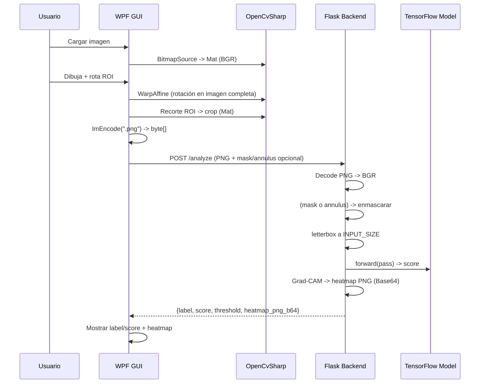

# ARCHITECTURE — BrakeDiscInspector

Este documento describe la arquitectura funcional del sistema, sus componentes, el flujo de datos extremo a extremo, el mapeo de coordenadas GUI↔imagen, y los puntos de extensión.

---

## 1) Visión general

El sistema está compuesto por dos procesos principales:

- **GUI (WPF / .NET)**: captura la imagen, permite dibujar/rotar el ROI, envía el **crop ya rotado** al backend, y muestra `label/score/threshold` + **heatmap**.
- **Backend (Flask / Python)**: recibe el crop, aplica *letterbox* y normalización, infiere con el modelo (TensorFlow), genera **Grad‑CAM** y devuelve resultados.

```mermaid
flowchart LR
    A[Usuario] -->|Carga imagen / Dibuja ROI| G[WPF GUI<br/>OpenCvSharp]
    G -->|/analyze<br/>PNG rotado + (mask/annulus)| B[(Flask + TF + OpenCV)]
    B -->|label / score / threshold / heatmap| G
    G -->|Visualiza resultado| A
```

---

## 2) Componentes

### 2.1 GUI (WPF)
- **MainWindow.xaml(.cs)**: orquesta UI, eventos, y acciones del usuario (cargar imagen, botón Analyze).
- **ROI/**:
  - `ROI.cs`: modelo de ROI (`X`, `Y`, `Width`, `Height`, `AngleDeg`, `Legend`).
  - `RoiRotateAdorner.cs`: adorner para **rotación en tiempo real** alrededor del centro del ROI.
  - `RoiAdorner.cs` (opcional): edición visual de tamaño/posición (si se integra).
- **Overlays/**:
  - `RoiOverlay.cs`: dibuja el ROI en el `CanvasROI` **alineado** con el área visible del `<Image>` (letterbox).
- **BackendAPI.cs**: cliente HTTP tipado (POST `/analyze`, GET `/train_status`, POST `/match_one`).
- **appsettings.json**: `Backend.BaseUrl`.

### 2.2 Backend (Flask)
- **app.py**:
  - Endpoints: `/analyze`, `/train_status`, `/match_one`.
  - Carga modelo `model/current_model.h5` y umbral `model/threshold.txt`.
  - Preprocesado (*letterbox*), inferencia, **Grad‑CAM**, codificación heatmap a PNG Base64.
- **utils/**: utilidades (`letterbox`, `masks/annulus`, `heatmap Grad‑CAM`, `schemas`).
- **logs/**: `backend.log`.

---

## 3) Flujo de datos (end‑to‑end)



---

## 4) Mapeo de coordenadas y *letterbox*

### 4.1 Alineación CanvasROI al `<Image Stretch="Uniform">`
Para sincronizar el canvas (overlay) con el área visible de la imagen renderizada:

```
scale = min(ImgMain.ActualWidth / PixelWidth, ImgMain.ActualHeight / PixelHeight)
drawWidth  = PixelWidth  * scale
drawHeight = PixelHeight * scale
offsetX = (ImgMain.ActualWidth  - drawWidth)  / 2
offsetY = (ImgMain.ActualHeight - drawHeight) / 2

CanvasROI.Width  = drawWidth
CanvasROI.Height = drawHeight
Canvas.SetLeft(CanvasROI, offsetX)
Canvas.SetTop(CanvasROI,  offsetY)
```

### 4.2 Conversión imagen ↔ canvas
- **Imagen → Canvas** (para pintar/adorners):
  ```
  sx = CanvasROI.Width  / PixelWidth
  sy = CanvasROI.Height / PixelHeight
  canvasX = imageX * sx
  canvasY = imageY * sy
  ```
- **Canvas → Imagen** (si hiciera falta):
  ```
  imageX = (canvasX) / sx
  imageY = (canvasY) / sy
  ```

### 4.3 Rotación del ROI (GUI)
- Se rota la **imagen completa** alrededor del centro `(ROI.X, ROI.Y)` con `Cv2.GetRotationMatrix2D` y `Cv2.WarpAffine`.
- Después se recorta la subimagen (`Rect(x,y,w,h)`), garantizando **mínimo 10×10**.

> Esta estrategia evita inconsistencias de coordenadas cuando el usuario rota el ROI: siempre enviamos un PNG ya rotado que el backend puede consumir sin conocer el ángulo.

---

## 5) Backend — preprocesado e inferencia

1. **Decodificar** PNG (BGR).
2. **Máscara/Annulus** (opcional):
   - `mask` PNG binaria: `img[mask==0] = 0`.
   - `annulus` JSON: rellena anillo `(cx,cy,ri,ro)` y anula el resto.
3. **Letterbox** al tamaño de entrada del modelo (p.ej. 224×224) preservando la relación de aspecto y con bordes negros.
4. **Inferencia (TensorFlow)**: salida `score ∈ [0,1]` (NG score).
5. **Decisión**: `label = "NG"` si `score ≥ threshold`, si no `"OK"`.
6. **Grad‑CAM**: localizar la última `Conv2D`, calcular mapa normalizado, reescalar a entrada, mezclar con la imagen (*overlay*) y **codificar en PNG Base64**.
7. **Respuesta**:
   ```json
   {"label","score","threshold","heatmap_png_b64"}
   ```

---

## 6) Errores típicos y manejo

- **CS1674 (using con `ImEncode`)**: `ImEncode` devuelve `byte[]` → **no** se usa `using`.
- **CS1061 (`ToWriteableBitmap`)**: usar `BitmapSourceConverter.ToBitmapSource(mat)` (paquete `OpenCvSharp4.Extensions`).
- **Adorner desalineado**: ejecutar `SyncOverlayToImage()` **antes** de crear el adorner y cuando cambie el tamaño (`SizeChanged`).
- **Handle de rotación no aparece**: comprobar que el adorner está anclado a `CanvasROI` y el centro devuelve coordenadas de **canvas** (no de imagen).

El backend devuelve errores legibles (`400` entrada inválida, `500` excepción). En ambos procesos se registran logs (`backend/logs/backend.log`, GUI opcional).

---

## 7) Configuración

- **GUI**: `gui/BrakeDiscInspector_GUI_ROI/appsettings.json`
  ```json
  { "Backend": { "BaseUrl": "http://127.0.0.1:5000" } }
  ```
- **Backend**:
  - Modelo: `backend/model/current_model.h5`
  - Umbral: `backend/model/threshold.txt` (p. ej., `0.57`)
  - Tamaño de entrada (`INPUT_SIZE`) en `app.py`.

---

## 8) Puntos de extensión

- **Nuevos endpoints**: agregar en `app.py` y documentar en `API_REFERENCE.md`.
- **Cambiar modelo**: sustituir `current_model.h5` y ajustar `INPUT_SIZE`/preprocesado.
- **Máscaras avanzadas**: soportar *multipart* con múltiples `mask` o parámetros adicionales.
- **Mejoras GUI**: snapping, restricción angular, sectores en annulus, múltiples ROIs y *batch analyze*.

---

## 9) Seguridad y despliegue

- Uso local por defecto (`127.0.0.1`).
- Para red/local/red interna: habilitar host `0.0.0.0` y proteger con firewall/VPN.
- Añadir logs con niveles por entorno (DEBUG/INFO/WARN/ERROR).

---

## 10) Referencias cruzadas

- **README.md** (visión general y *quick start*)
- **API_REFERENCE.md** (contratos/ejemplos)
- **ROI_AND_MATCHING_SPEC.md** (geometría y reglas ROI)
- **DEV_GUIDE.md** (setup detallado)
- **DEPLOYMENT.md** (smoke tests)
- **LOGGING.md** (política de logs)
